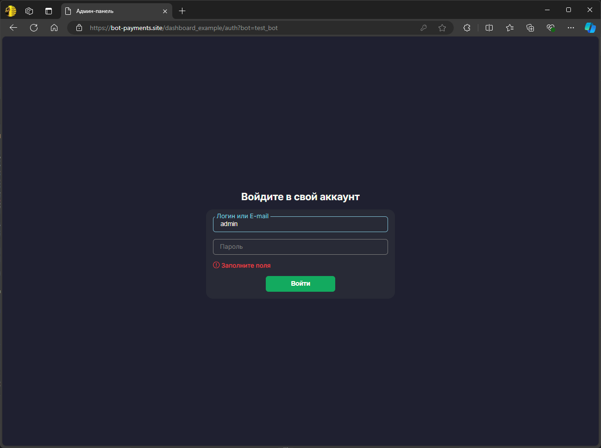

# Описание

Это фронтенд-часть проекта. [Бэкенд проекта доступен тут.](https://github.com/sssehnsuchttt/dashboard-backend-example/)

## О проекте

Этот проект представляет собой пример реальной разработки, выполненной мною для заказчика. С его разрешения я адаптировал проект, чтобы продемонстрировать ключевой функционал веб-приложения. 

Для защиты конфиденциальных данных были произведены следующие изменения:

- Вырезаны или заменены заглушками почти все функции бота, которые не связаны с работой с сайтом
- Удалены некоторые разделы на фронтенде, не касающиеся основной логики
- Для упрощения PostgreSQL был заменен на SQLite
- Вместо реальных данных в проекте используются фиктивные данные

Цель этого примера — продемонстрировать мои навыки на реальном проекте, сохранив при исходные данные в безопасности

## Стек технологий

- **Frontend**: Node.js, React, Material UI, Axios, Chart.js
- **Backend**: Python, Aiogram, Aiohttp, PyJWT
- **База данных**: SQLite
- **Деплой**:
  - **VDS сервер** для хостинга
  - **Nginx** для маршрутизации и управления SSL-сертификатами
  
## Демонстрация проекта

Вы можете ознакомиться с проектом через Telegram, запустив бота по следующей ссылке: [запустить бота](https://t.me/test081024_bot?start=set_new_admin)

### Как это работает:
1. После запуска бота Вам будут автоматически присвоены права администратора
2. Бот перезагрузится, и Вы сможете изменить пароль для панели управления
3. После изменения пароля Вы получите доступ к панели управления, где сможете исследовать функционал

> **Примечание:** Для работы проекта требуется **HTTPS-домен** с корректно настроенными маршрутами. Telegram не поддерживает работу с **localhost**, поэтому проект нельзя полноценно запустить на локальном сервере.

---

## Установка и запуск проекта

### Предварительные требования:
- **Node.js** версии 14.x или выше
- **npm** или **yarn** для управления зависимостями
- **Python** версии 3.8.10 или выше

---

### Шаги для локальной установки фронтенда:

1. **Клонируйте репозиторий:** 
  `git clone https://github.com/sssehnsuchttt/react-dashboard-example.git && cd react-dashboard-example`
2. **Установите зависимости:** 
   `npm install`
3. **Запустите проект в режиме разработки:** 
   `npm run build`
4. **При необходимости измените адрес сайта, на который посылаются запросы, в `src/index.js`.**

---

### Шаги для локальной установки бэкенда:

1. **Клонируйте репозиторий:** 
  `git clone https://github.com/sssehnsuchttt/dashboard-backend-example.git && cd dashboard-backend-example`
2. **Создайте и активируйте виртуальное окружение:** 
   `python -m venv venv && source venv/bin/activate` (или `venv\Scripts\activate` для Windows)
3. **Установите зависимости:** 
   `pip install -r requirements.txt`
4. **Настройте файл `settings.ini`:** 
   Вам нужно будет вставить такие данные, как токен вашего бота, путь к базе данных и другие параметры
5. **Запустите проект:** 
   `python main.py`

## Скриншоты проекта

### 1. Бот в Telegram
На данном скриншоте показано, как выглядит бот в Telegram. После запуска бот выдает вам права администратора и предоставляет ссылку на админ-панель 

---

### 2. Страница авторизации
Здесь показана страница авторизации, где пользователь вводит свои учетные данные (логин и пароль), чтобы получить доступ к панели управления ботом

---

### 3. Главная страница панели управления
Это главная страница панели управления, где отображаются основные настройки бота, а также статистика

---

### 4. Смена темы (темная и светлая темы)
Пользователь может переключаться между темной и светлой темой интерфейса. Вот пример светлой темы

---

### 5. Редактор базы данных
На данном скриншоте показан редактор базы данных. Пользователь может просматривать и редактировать записи в базе данных напрямую через интерфейс панели

---

### 6. Адаптация под мобильные экраны
Проект адаптирован для мобильных устройств, что позволяет комфортно работать с панелью управления на небольших экранах. Ниже представлены скриншоты мобильной версии 
 

---

### 7. WebApp в Telegram
Приложение также интегрировано с WebApp Telegram, что позволяет пользователю быстро получать доступ к нужной информации. Приложение полностью совместимо с мобильными устройствами 
 

